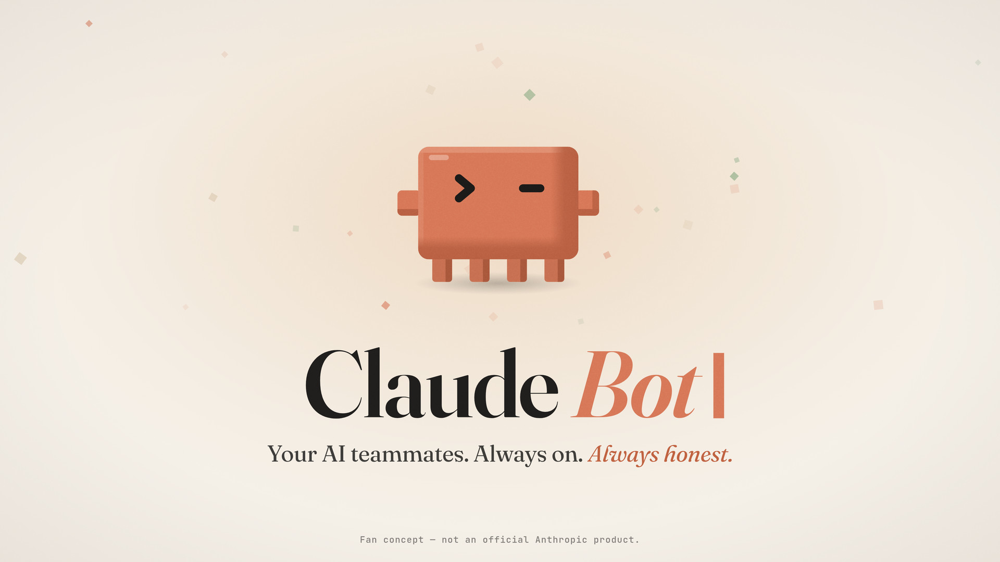

# Claude Bot — 60-second fan-concept reveal

**▶ [Watch the video — `claude-bot-reveal.mp4`](claude-bot-reveal.mp4)** · 1920×1080 · 60 fps · H.264 + AAC · 62 s (the 60-second piece plus its reverb tail over black) · 36 MB

A single self-contained `index.html`: every visual is HTML/SVG, and all music and sound effects are synthesized live in the browser with [Tone.js](https://tonejs.github.io/) (loaded from cdnjs). The page uses no voiceover and no image or audio files.

> Fan concept — not an official Anthropic product.

## Run it

Open `index.html` in a browser and press **▶ Play** (or Space). Browsers need that click before they allow audio. When it finishes, **↻ Replay** restarts it.

- The 1920×1080 stage scales to fit any window (16:9, letterboxed).
- The visuals follow `Tone.Transport` at the moment the audio is actually heard (output-latency compensated), so picture and sound stay locked. If the tab is hidden, the picture catches up when you come back.
- If Tone.js can't load, it retries jsDelivr and unpkg, and if those fail too the animation plays silently.

## The video

`claude-bot-reveal.mp4` is rendered from this same page rather than screen-recorded, so it matches the live version exactly:

- **Picture:** each frame is captured at its exact timestamp at 60 fps. Frames are drawn at 3840×2160 and downscaled to 1080p for clean edges.
- **Sound:** the same score is rendered offline with Tone.js at 48 kHz, so every hop and hit lands on its frame. The video's audio is mastered to −16 LUFS; the live page plays the unmastered mix, about 8 dB quieter.
- **Encoding:** H.264 High profile (CRF 16, BT.709 colour) with 320 kbps AAC, set up for streaming ("fast start").

## How it's built

- **One Clawd rig** (`class Clawd`) is used in every scene, so the character always looks the same. It has an orange body with darker shading on the right and bottom, block arms and four square legs. Its chevron eyes have five states: `> <` happy, `• •` curious, `- -` thinking, `^ ^` proud, `> -` wink. It breathes, blinks, squashes and stretches on hops, and walks with a tap-tap leg cycle.
- **Everything is authored in beats** (110 BPM → 6/11 s per beat). Each scene is a pure function of the current beat, so any frame can be rendered at any time.
- **One event list drives the audio.** Hops, footsteps, clicks and pops add their sound effects to the same score as the music, so every sound lands exactly on the visual moment.

### Timing map (scene cuts land on beats)

| Scene | Beats | Time | Music |
|---|---|---|---|
| 1 Boot up | 0–12 | 0:00–0:06.5 (wipe at 0:06.0) | solo 8-bit arpeggio + vinyl crackle |
| 2 Its own computer | 12–24 | 0:06.5–0:13.1 | + soft kick, bass, pads fade in |
| 3 Text it like a teammate | 24–36 | 0:13.1–0:19.6 | + marimba, chiptune lead |
| 4 Meet the team | 36–52 | 0:19.6–0:28.4 | full groove, sidechained pads |
| 5 Show it once | 52–64 | 0:28.4–0:34.9 | double-time arp, glitchy pitch-up fill |
| 6 Connects to everything | 64–77 | 0:34.9–0:42.0 | warm strings, a rising pluck per icon |
| 7 It asks first | 77–92 | 0:42.0–0:50.2 | felt-piano Bm breakdown → approve → riser |
| 8 Reveal | 92–110 | 0:50.2–1:00.0 | final swell → D-major hit (0:57.8) → cut to black at 1:00 |

The music is an original piece in D major on a D–Bm–G–A progression, ending with a G–A–D cadence. The instruments are a square-wave chiptune lead, a pulse arpeggio, sawtooth pads and strings, an FM marimba and pluck, a round mono bass, soft membrane/noise drums, a sine "felt piano" and a filtered-noise vinyl bed. They run through a compressor and limiter with a shared reverb, and the master sits at −8 dB.
